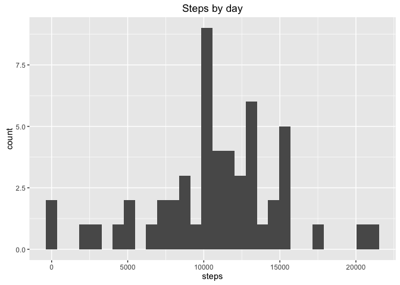
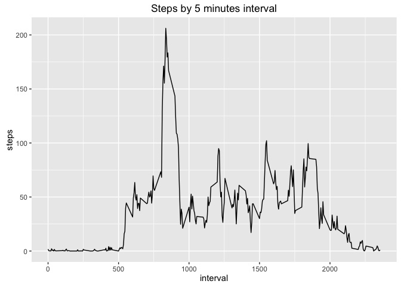
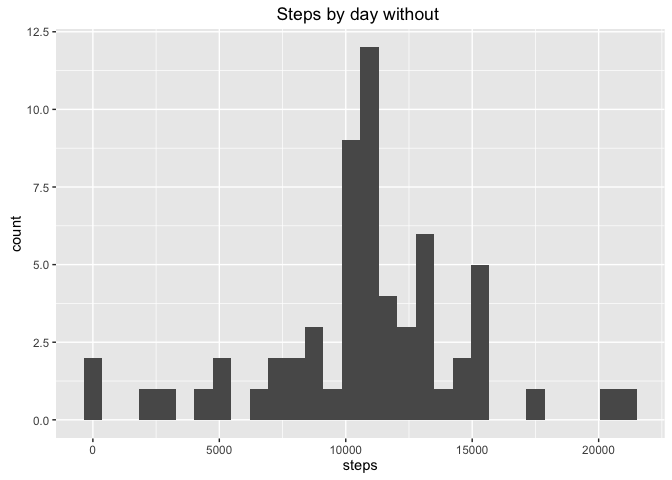
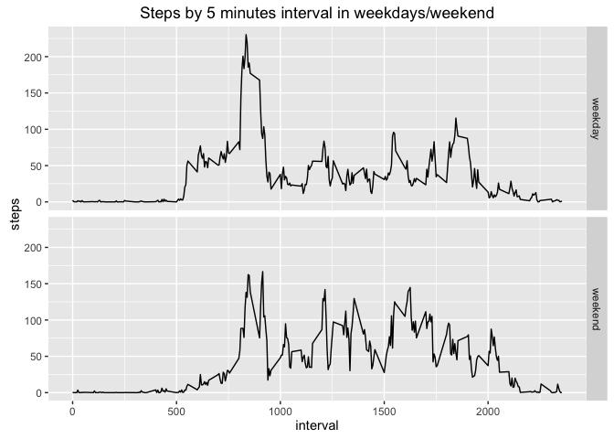

# Reproducible Research: Peer Assessment 1


## Loading and preprocessing the data

```r
library(ggplot2)
```

```
## Warning: package 'ggplot2' was built under R version 3.2.4
```

```r
activity<-read.csv("activity.csv")
```


## What is mean total number of steps taken per day?


```r
#steps by day
steps_day<-aggregate(steps~date, data=activity, sum)

#histogram
qplot(steps, data=steps_day,main="Steps by day");
```

```
## `stat_bin()` using `bins = 30`. Pick better value with `binwidth`.
```



```r
#mean
mean_steps<-mean(steps_day$steps)
mean_steps
```

```
## [1] 10766.19
```

```r
#median
median_steps<-median(steps_day$steps)
median_steps
```

```
## [1] 10765
```

The mean steps taken by day are 10766.19 and the median 10765


## What is the average daily activity pattern?


```r
#Average number of steps taken on the 5 minutes interval
activity_day<-aggregate(steps~interval, data=activity, mean)

#Plot
ggplot(activity_day,aes(interval,steps))+geom_line()+labs(title="Steps by 5 minutes interval")
```



```r
#Interval the maximum number of steps
max_index<-which.max(activity_day$steps)
max_interval<-activity_day$interval[max_index]
max_interval
```

```
## [1] 835
```
The maximum number of steps by day are in the 835 interval


## Imputing missing values


```r
#Number of missing values
missing_values<-sum(!complete.cases(activity))
missing_values
```

```
## [1] 2304
```

```r
#The missing values are filled with the mean of the steps this interval
new_activity<-activity
for (i in 1:nrow(new_activity)){
  new_activity[i,][is.na(new_activity[i,])]<-activity_day[activity_day$interval==new_activity[i,3],]$steps
}

#Repeat the calculous of the histogram, mean and median
#steps by day
new_steps_day<-aggregate(steps~date, data=new_activity, sum)

#histogram
qplot(steps, data=new_steps_day,main="Steps by day without ");
```

```
## `stat_bin()` using `bins = 30`. Pick better value with `binwidth`.
```



```r
#mean
new_mean_steps<-mean(new_steps_day$steps)
new_mean_steps
```

```
## [1] 10766.19
```

```r
#median
new_median_steps<-median(new_steps_day$steps)
new_median_steps
```

```
## [1] 10766.19
```

```r
#difference with before
mean_steps-new_mean_steps
```

```
## [1] 0
```

```r
median_steps-new_median_steps
```

```
## [1] -1.188679
```

The mean of the two datasets (with and without NAs) is the same but the median is 1.19 less in the old dataset.

## Are there differences in activity patterns between weekdays and weekends?


```r
#New factor variable indicating if it's weekday or weekend
new_activity$date<-as.Date(new_activity$date)
l <- weekdays(new_activity$date) == "sábado" | weekdays(new_activity$date) == "domingo"
new_activity$day[l] <- "weekend"
new_activity$day[!l] <- "weekday"
new_activity$day <- factor(new_activity$day)

#Average number of steps by interval and weekday/weekend
activity_week<-aggregate(steps~interval+day, data=new_activity, mean)

#Plot
ggplot(activity_week,aes(interval,steps))+geom_line()+labs(title="Steps by 5 minutes interval in weekdays/weekend")+facet_grid(day~.)
```



